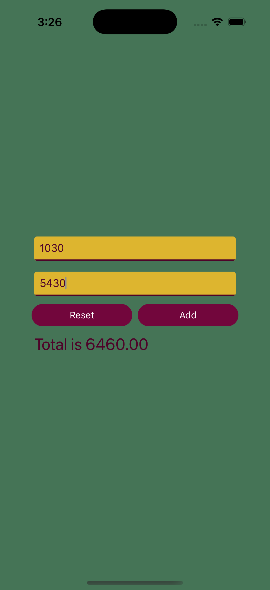
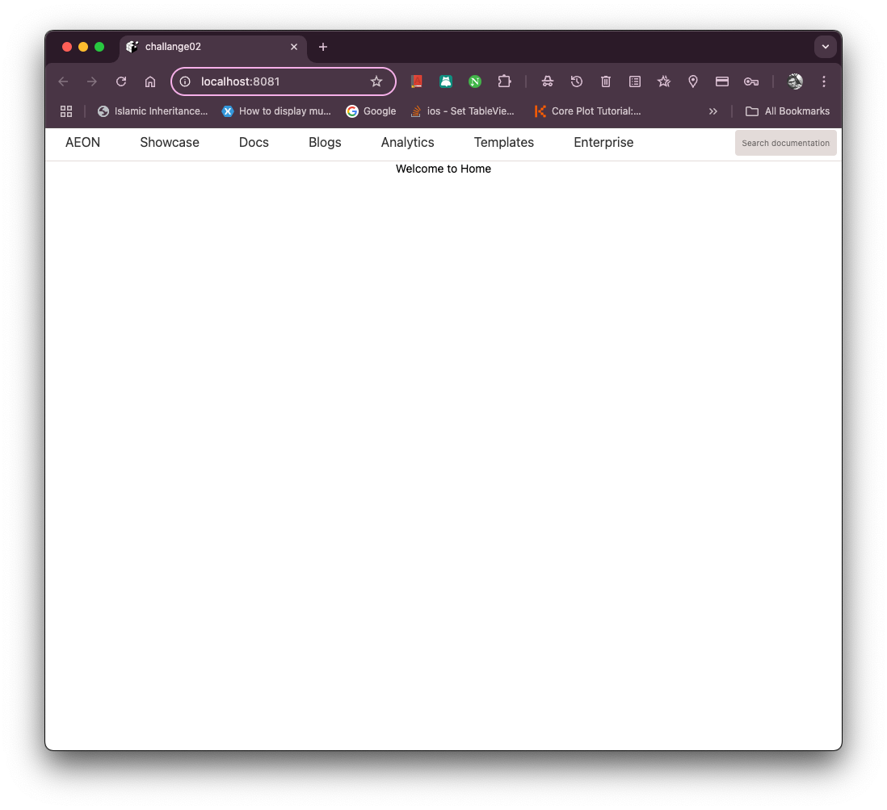
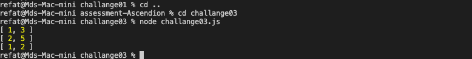

# Ascendion Assessment

These are the three challanges given by Ascendion to solve.

## How to run

### Prerequisites

- **Node.js** (version 14 or higher) installed on your machine.
- **Xcode**
- **Android Studio**
- **Expo go**
- **Expo CLI** installed globally:(Optional)
  ```bash
  npm install -g expo-cli
  ```

### Installation

Clone the repository

```bash
  git clone git@github.com:RefatIbnAnwar/assessment-Ascendion.git
```

#### Install dependencies:

Go to every challange folder and install the dependencies

```bash
    npm install
```

#### **Run Challange 1**

1. go to challange01 folder and intall dependencies

```bash
    cd challange01
    npm install
```

2. run in the terminal

```bash
    npm start
```

3. **Web** To run in the browser install following modules

```base
npx expo install react-dom react-native-web @expo/metro-runtime
```

4. select a for android, i for iOS, w for web.

**Project should run based on your selection**

#### Screenshot



#### **Run Challange 2**

1. go to challange02 folder and intall dependencies

```bash
    cd challange02
    npm install
```

2. run in the terminal

```bash
    npm start
```

3. **Web** To run in the browser install following modules

```base
npx expo install react-dom react-native-web @expo/metro-runtime
```

4. select w for web.

**Project should run based on your browser**

#### Screenshot



NB: **I partially completed it because in React Native I can not use </a/> tag with href=”/”, I think it can be done with react. And for the mobile part it is possible to create the UI but I need more time. I apologize for the inconvenience.**

#### **Run Challange 3**

1. go to challange03 folder

```bash
    cd challange03
```

2. run in the terminal

```bash
    node challange03.js
```

That should run the the program in console.

#### Screenshot



Thank you for your time.

### For questions or feedback

- **Email**: refatibnanwar@gmail.com
